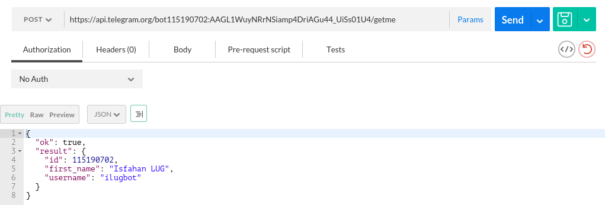
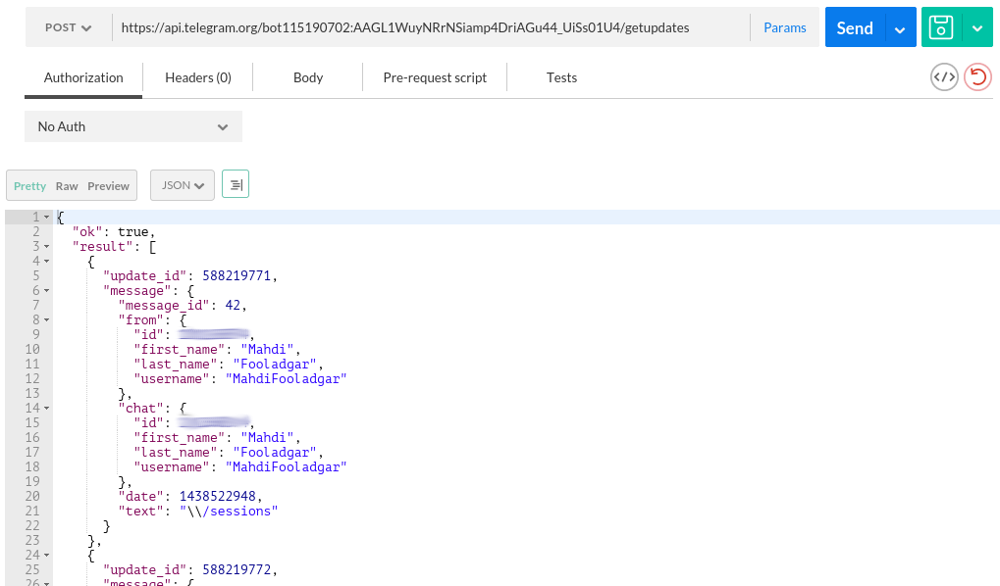

name: How to create a Telegram Bot
class: center, middle, inverse


# How to create a Telegram Bot

## Isfahan LUG, Aug. 2015

### Alireza Omidi
### Mahdi Fooladgar

[](https://github.com/alirezaomidi/telegram-ilugbot)

---

# Agenda

1. What is a bot?
2. The Botfather
3. API
4. Python Telegram Bot Project
5. Write your own bot

---

# What is a bot?

> Bots are simply Telegram accounts operated by software – not people – and they'll often have AI features.
>
> They can do anything – teach, play, search, broadcast, remind, connect, integrate with other services, or even pass commands to the Internet of Things.
>
> -- <cite>Telegram blog</cite>

---

# Differences with humans:

1. No online status and no last seen timestamps.
--

2. Limited cloud storage.
--

3. Can't initiate conversations with users. Users **must** start conversation or add to groups. The link is `telegram.me/<bot_username>`.
--

4. Usernames always end in 'bot'.
--

5. When added to a group, bots do not receive all messages by default.
--

6. Bots never eat, sleep or complain (unless expressly programmed otherwise).

---

class: center

# The Botfather
> #### One Bot to rule them all, One Bot to find them
> #### One Bot to bring them all and in the darkness bind them
>
> -- <cite>The Lord of the Bots, J.R.R.Tolkien</cite>


---

# The Botfather

### Create a new bot
1. `/newbot`
--

2. Enter name of the Bot; e.g. **Isfahan LUG**
--

3. Enter the username of the bot; e.g. **ilugbot**
--

4. Write down the token.

---

# API

- The Bot API is an HTTP-based api. It supports **GET** and **POST** requests.
--


### Making Requests:
- All queries must be served over **HTTPS** and in this form:
`https://api.telegram.org/bot<token>/METHOD_NAME`
--

- All queries must be made using **UTF-8**.
--

- All methods are case-insensitive.
--

- The response is a **JSON** object which:
    - always has an 'ok' boolean field.
--
    - has a 'result' field if the response is ok.
--
    - may have an optional 'description' field which contains some info about the occurred error.
--
    - also has a 'error_code' in the case of errors.

---

# Some Examples

- Use [Postman](https://www.getpostman.com/) in order to test the API.

.center[]

---

# Some Examples

- Use [Postman](https://www.getpostman.com/) in order to test the API.

.center[]

---

# Python Telegram Bot

### Sweet Python!

In order to make requests, we need an interface. Here we use `python-telegram-bot` which is written in Python.

It is under development and is well written.
check out the [project site](https://github.com/leandrotoledo/python-telegram-bot).
--

* Installing
```bash
pip install --upgrade python-telegram-bot
```
--

* Using
```python
>>> import telegram
>>> bot = telegram.Bot(token='your_bot_token')
```

---

# Some Examples
* To get Bot's info:
```python
>>> print bot.getMe()
```

* To get updates:
```python
>>> updates = bot.getUpdates()
>>> print [u.message.text for u in updates]
```

* To send a text message:
```python
>>> chat_id = bot.getUpdates()[-1].message.chat_id
>>> bot.sendMessage(chat_id=chat_id, text="Can I help you?")
```

* To send an Emoji:
```python
>>> bot.sendMessage(chat_id=chat_id, text=telegram.Emoji.SEE_NO_EVIL_MONKEY)
```

---

class: center, middle

# Time to write your own bot!

---

class: center, middle

# Thank you

### Alireza Omidi
[Github](https://github.com/alirezaomidi)  
[@alirezageek](https://twitter.com/alirezageek)  
### Mahdi Fooladgar
[Github](https://github.com/professormahi)  
[@professormahi](https://twitter.com/professormahi)
